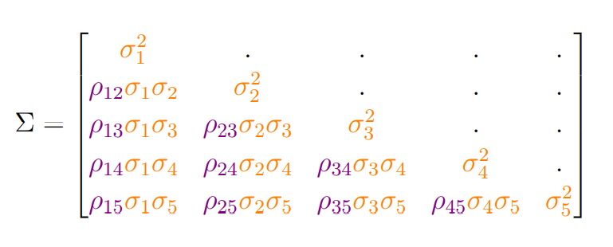

```{r setup, include=FALSE}

libs <- c("dplyr","huxtable","foreign","haven","tidyr","stringr","ggplot2","lsmeans","emmeans","nlme","broom","lme4","multcomp")

lapply(libs, library, character.only=T)
```

## Reference

  [Fitting linear mixed models in R: Brice Ozenne](http://staff.pubhealth.ku.dk/~jufo/courses/rm2018/nlmePackage.pdf) 


## Packages   

  - `nlme package`: it enables to specify the form of the correlation structure between residuals, to model a potential heteroscedasticity and to consider random effects.    
    It is limited to Gaussian variables but can handle non-linear relationships   
  
  
  - `lme4 package`: it is a numerically more efficient alternative to `nlme` which is recommended for large datasets or when several random effects are considered.   
    Contrary to nlme, the correlation structure between residuals can only be model through random effects.    
    No option for dealing with heteroscedasticity other than using random effects (e.g. random slope).   
    `lme4` enables to model non-Gaussian dependent variables (e.g. binary, Poisson, . . . ).
    
    
## data set-up

```{r,echo=T,warning=FALSE,error=F,message=F, comment=''}
# Data Set-up 
path <- "https://content.sph.harvard.edu/fitzmaur/ala2e/cholesterol-data.txt"
dfW.data <- read.table(file.path(path), na.string = ".")

dfW.data <- dfW.data %>%  
  setNames(c("group","id","y0","y1","y2","y3","y4")) %>%
  mutate(group = factor(group,levels=1:2, labels=c("T","C")),
         group = relevel(group, ref="C"),
         id = as.factor(id))

dfL.data <- dfW.data %>% 
  pivot_longer(cols=-c("group","id"),values_to="cholesterol", names_to="time")%>%
  mutate(time = str_replace(time,"[a-z]+", "visit"),
         t = as.numeric(str_extract(time,"\\d+")),
         time = relevel(as.factor(time),ref="visit0"),
         treatment = if_else(time=="visit0","none",as.character(group)),
         treatment = factor(treatment,levels=c("none","C","T"),
                            labels = c("none","pl","tr"))
         ) %>%
  arrange(id,time)
  

```

## dataset

```{r,echo=F,warning=FALSE,error=F,message=T, comment=''}
dfL.data %>% head() %>% as_hux() %>%
  set_bottom_border(1, everywhere) %>% 
  set_top_border(row=1, everywhere,brdr(thickness=2, style="double")) %>%
  set_bottom_border(final(1), everywhere) %>%
  set_width(0.8)

```


```{r,echo=T,warning=FALSE,error=F,message=F, comment='', include=FALSE}

model.matrix(∼ group + time, data = dfL.data[dfL.data$id=="1",])

```


## Using the `gls()` function of the nlme package

```{r,echo=T,warning=FALSE,error=F,message=F, comment='', include=FALSE}
# Arguments in the function

args(nlme::gls)

```

- `data`: specify dataset to use   
- `model`: a formula, e.g. cholesterol ∼ group where:   
   - the left hand side (here cholesterol) indicates the response variable $Y_i$,   
   - the right hand side (here group) defines the model for the mean i.e. in $\mu(\mathbf{X}_i) = \beta X_i$ what are the explanatory variables (by default R includes an intercept).      
   In our example, the model would be $\mu(X_i) = \alpha + \beta_G \mathbb{1}_{group_i=T}$
   
   where $1_{group_i=T}$ is binary variable taking value $1$ if the individual $i$ belongs to the treatment group and 0 otherwise.   
  

- `correlation, weights`: defines the covariance structure,
- `method`: defines which objective function should maximized in order to estimate the model parameters $(\beta, γ)$.
- `na.action`: indicates how to deal with missing values.   
   


## Specifying the mean structure
### without interactions

```{r,echo=T,warning=FALSE,error=F,message=F, comment='', include=T}

e.gls <- gls(model = cholesterol ~ group + time, 
             data = dfL.data, 
             na.action = na.omit)
  #  estimated mean parameters
# attributes(summary(e.gls))
summary(e.gls)$tTable 
```


## Specifying the mean structure
### without interactions ...

To Interpret the estimated coefficients.

\[Y_{ij} = \alpha+\beta_G 1_{group_i=T} + \beta_{v1} 1_{j=1} + \beta_{v2} 1_{j=2} + \beta_{v3} 1_{j=3} + \beta_{v4} 1_{j=4} + \varepsilon_{ij} \]  
\[\varepsilon_{ij} \sim N(0, \sigma^2) \]

where:     
$1_{group_i=T}$ is the indicator variable taking value 1 when the individual is in the treatment group and 0 otherwise.      
$1_{visit=1}$ is the indicator variable taking value 1 for the first visit and 0 otherwise.   
Note: that the design matrix is a matrix whose $i − th$ line combines one (for the intercept) with all
the indicator variables for individual $i$:

\[X_i = [1, 1_{group_i=T} , 1_{j=1}, 1_{j=2}, 1_{j=3}, 1_{j=4}]\]


## Specifying the mean structure
### without interactions ...

e.g, Design matrix for the 4 observations:

```{r,echo=T,warning=FALSE,error=F,message=F, comment='', include=T}
dfL.data[c(1:2,396:397),]
```


```{r,echo=T,warning=FALSE,error=F,message=F, comment='', include=T}
(X <- model.matrix(∼ group + time, data = dfL.data[c(1:2,396:397),]))
```

## Specifying the mean structure
### without interactions ...

If interest is treatment effect at baseline. The effect can be written in mathematical term as:

\[E[Y_{ij}|group=T, visit = 0] - E[Y_{ij}|group=C, visit = 0]\]    

The residuals have mean 0, i.e. $E[\varepsilon_{ij}]=0$, and are independent of the covariates,       
we get:

\[E[\varepsilon_{ij}|group=T, visit=0]=E[\varepsilon_{ij}|group=C, visit=0]=0\]  

Applying the conditional expectation to equation (i.e. removing the residual:


\begin{eqnarray*} 
E[Y_{ij}|group=T, visit = 0] & = & \alpha+\beta_G*1 + \beta_{v1}*0 + \beta_{v2}*0+ \beta_{v3}*0 + \beta_{v4}*0 \\[0.03in]
& = & \alpha+\beta_G \\[0.03in]

E[Y_{ij}|group=C, visit = 0] & = & \alpha+\beta_G*0 + \beta_{v1}*0 + \beta_{v2}*0+ \beta_{v3}*0 + \beta_{v4}*0 \\[0.03in]
& = & \alpha

\end{eqnarray*}

the treatment effect equals:


\[E[Y_{ij}|group=T, visit = 0] - E[Y_{ij}|group=C, visit = 0] = \alpha+\beta_G - \alpha = \beta_G\]


## Specifying the mean structure
### without interactions ...

We can get this also from the contrast matrix, by subtracting the row corresponding
to the patient from the control group at baseline to the row corresponding to the
patient from the treatment group at baseline:

```{r,echo=T,warning=FALSE,error=F,message=F, comment='', include=T}
#treatment effect at baseline
X[1,]-X[3,]

coef(e.gls)

sum((X[1,]-X[3,])*coef(e.gls)) #i.e estimated βG
```


## Specifying the mean structure
### with interactions

```{r,echo=T,warning=FALSE,error=F,message=F, comment='', include=T}

e.glsI <- gls(model = cholesterol ~ group * time, 
             data = dfL.data, 
             na.action = na.omit)
  #  estimated mean parameters
summary(e.glsI)$tTable

```


## Specifying the mean structure
### with interactions ...

Model we have fitted for individual $i$ at visit j:

\begin{eqnarray*} 
Y_{ij} & = & \alpha + \beta_G 1_{group_i=T} + \beta_{v1} 1_{j=1} + \beta_{v2} 1_{j=2} + \beta_{v3} 1_{j=3} + \beta_{v4} 1_{j=4} \\
& + & \beta_{I1} 1_{group_i=T}1_{j=1} + \beta_{I2} 1_{group_i=T}1_{j=2} +  \beta_{I3} 1_{group_i=T}1_{j=3} +  \beta_{I4} 1_{group_i=T}1_{j=4}  \\
& + & \varepsilon_{ij},\varepsilon_{ij} \sim N(0, \sigma^2) 
\end{eqnarray*}

```{r,echo=T,warning=FALSE,error=F,message=F, comment='', include=T}
#  design matrix for the four observations
(X <- model.matrix(∼ group * time, data = dfL.data[c(1:2,396:397),]))
```


## Specifying the mean structure
### with interactions ...


If interest is treatment effect at visit 1. The effect can be written in mathematical term as:

\[E[Y_{ij}|group=T, visit = 1] - E[Y_{ij}|group=C, visit = 1]\]    

The residuals have mean 0, i.e. $E[\varepsilon_{ij}]=0$, and are independent of the covariates,       
we get:

\[E[\varepsilon_{ij}|group=T, visit=0]=E[\varepsilon_{ij}|group=C, visit=0]=0\]  

Computing each term:

\begin{eqnarray*} 
E[Y_{ij}|group=T, visit = 1] & = & \alpha+\beta_G*1 + \beta_{v1}*1 + \beta_{v2}*0+ \beta_{v3}*0 + \beta_{v4}*0 \\
 & + & \beta_{I1}*1*1 + \beta_{I2}*1*0+ \beta_{I3}*1*0 + \beta_{I4}*1*0 \\
 & + & 0 \\
& = & \alpha+\beta_G + \beta_{v1} + \beta_{I1} \\[0.03in]

E[Y_{ij}|group=C, visit = 1] & = & \alpha+\beta_G*0 + \beta_{v1}*1 + \beta_{v2}*0+ \beta_{v3}*0 + \beta_{v4}*0 \\
 & + & \beta_{I1}*0*1 + \beta_{I2}*0*0+ \beta_{I3}*0*0 + \beta_{I4}*1*0 \\
 & + & 0 \\
& = & \alpha+ \beta_{v1} \\[0.03in]

\end{eqnarray*}

the treatment effect equals:

\begin{eqnarray*} 
E[Y_{ij}|group=T, visit = 1] & - & E[Y_{ij}|group=C, visit = 1] \\
& = & \alpha+\beta_G + \beta_{v1} + \beta_{I1}- \alpha - \beta_{v1} \\
& = & \beta_G + \beta_{I1}
\end{eqnarray*}


## Specifying the mean structure
### with interactions ...


```{r,echo=T,warning=FALSE,error=F,message=F, comment='', include=T}
# Treatment effect at visit 1
X[2,]-X[4,]

coef(e.glsI)

sum((X[2,]-X[4,])*coef(e.glsI)) #i.e estimated βG
```


## Specifying the variance-covariance matrix

Choosing the structure of the variance-covariance matrix $\Sigma$ of the residuals:  

$\varepsilon_{i} ∼ N (0,\Sigma)$   

In our example, we have 5 repetitions So $\Sigma$ is a matrix with 5 rows and 5 columns. 

```{r, echo=FALSE, out.width="55%", fig.align='center'}
knitr::include_graphics("cov1.png")
```

The diagonal terms tell about the variance of the residual at each time, e.g. $\sigma^2_{11}=\sigma^2_{22}$ indicates that the residual variability is the same at time 1 and 2.    
The off-diagonal terms tell about the covariance of the residual between timepoints. 

## Specifying the variance-covariance matrix ...

It is often easier to think in term of correlation instead of covariance. So we re-parametrize $\Sigma$:

```{r, echo=FALSE, out.width="45%", fig.align='center'}

```
So that now we have 5 orange parameters that model the variance at each time and 10 correlation parameters that model the correlation between the residuals.   

## Specifying the variance-covariance matrix ...
### `gls()`

In practice `gls` uses a slightly different parameterisation:

```{r, echo=FALSE, out.width="45%", fig.align='center'}

```

where there is a "baseline" variance level, $\sigma^2$ and the parameters $k^2_2, ...,k^2_5$ reflect the relative increase or decrease in variance over time.


## Specifying the variance-covariance matrix ...
### `gls()`

gls uses 2 arguments to specify $\Sigma$:

i) `correlation`: specifies the form of the **correlation  terms**. It will typically be: 
`corCompSymm(form = ∼ 1|subject)` or `corSymm(form = ∼ visit|subject)` and is composed of 3 parts:

   - **structure** of the correlation matrix. `corCompSymm` forces all the correlation coefficients to be equal or `corSymm` that puts no constrain. See `?corClasses` for other available structures.    
   
   - **position** variable. This is usually not needed when using `corCompSymm` (i.e. `∼1`).      
   When using `corSymm` it is used to indicate to which repetition belong the observation (e.g. first visit or second visit, i.e. `∼ visit` where visit is a numeric variable).   
   In other structures it can be used to specify explanatory variables (e.g. geographical position)
   
   - **grouping** variable (.e.g `|subject`). This indicates that observations are correlated within a group and therefore jointly model all observations belonging to the same group (here to the same subject).    
   

## Specifying the variance-covariance matrix ...
### `gls()`

gls uses 2 arguments to specify $\Sigma$:  
   
ii) `weight`: specifies the form of the **variance terms**. It will typically be: `varIdent(form = ∼ 1|visit)`
and is also composed of 3 parts:   

    - **structure** of the variance terms. We will only use `varIdent` that uses a different variance parameter at each repetition time.    
  
    - **position** variable. This is usually not needed when using varIdent (i.e. `∼1`).  
  
    - **grouping** variable. This variable indicate to which repetition belong the observation (e.g. `|visit`).
  
   
   
## Illustration - compound symmetry structure
### `gls()`

```{r, echo=FALSE, out.width="35%", fig.align='center'}

```


```{r,echo=T,warning=FALSE,error=F,message=F, comment='', include=T}

e.glsCS <- gls(model = cholesterol ~ group * time, 
             data = dfL.data,
             correlation = corCompSymm(form = ~1|id),
             na.action = na.omit)
  #  estimated mean parameters
# summary(e.glsCS)$tTable
logLik(e.glsCS)
```

## Illustration - compound symmetry structure ...
### `gls()`


Estimated Correlation parameter $\rho$

```{r,echo=T,warning=FALSE,error=F,message=F, comment='', include=T}
summary(e.glsCS)$modelStruct$corStruct

```

and the square root of the variance parameter ($\sigma^2$):

```{r,echo=T,warning=FALSE,error=F,message=F, comment='', include=T}
sigma(e.glsCS)
```

## Illustration - compound symmetry structure ...
### `gls()`

We can extract the residual variance-covariance matrix for the first individual using `getVarCov`


```{r,echo=T,warning=FALSE,error=F,message=F, comment='', include=T}
(Sigma <- getVarCov(e.glsCS, individual = 1))
```


and rescale it into a correlation matrix using `cov2cor`:


```{r,echo=T,warning=FALSE,error=F,message=F, comment='', include=T}
cov2cor(Sigma)
```


   
   
## Illustration - unstructured covariance matrix
### `gls()`

```{r, echo=FALSE, out.width="35%", fig.align='center'}

```


```{r,echo=T,warning=FALSE,error=F,message=F, comment='', include=T}

e.glsUN <- gls(model = cholesterol ~ group * time, 
             data = dfL.data,
             correlation = corSymm(form = ~as.numeric(time)|id),
             weights = varIdent(form = ~1|time),
             na.action = na.omit)
  #  estimated mean parameters
# summary(e.glsUN)$tTable
logLik(e.glsUN)
```

## Illustration - unstructured covariance matrix ...
### `gls()`


Estimated Correlation parameters $\rho_{12},\dots,\rho_{45}$

```{r,echo=T,warning=FALSE,error=F,message=F, comment='', include=T}
summary(e.glsUN)$modelStruct$corStruct

```


the inflation factors for the variance $k^2_2, ...,k^2_5$

```{r,echo=T,warning=FALSE,error=F,message=F, comment='', include=T}
summary(e.glsUN$modelStruct$varStruct)

```


and the square root of the variance parameter ($\sigma^2$):

```{r,echo=T,warning=FALSE,error=F,message=F, comment='', include=T}
sigma(e.glsUN)
```

## Illustration - unstructured covariance matrix ...
### `gls()`

We can extract the residual variance-covariance matrix for the first individual using `getVarCov`


```{r,echo=T,warning=FALSE,error=F,message=F, comment='', include=T}
(Sigma <- getVarCov(e.glsUN, individual = 1))
```


and rescale it into a correlation matrix using `cov2cor`:


```{r,echo=T,warning=FALSE,error=F,message=F, comment='', include=T}
cov2cor(Sigma)
```


## Technical point: why using `as.numeric(time)` in `corSymm`   

Using `~as.numeric(time)|id` in `corSymm`. `as.numeric(time)` is here to indicate the time repetition. If we don't and instead use  `~1|id` we get different estimates:


```{r,echo=T,warning=FALSE,error=F,message=F, comment='', include=T}

eWrong.glsUN<- gls(model = cholesterol ~ group * time, 
             data = dfL.data,
             correlation = corSymm(form = ~1|id),
             weights = varIdent(form = ~1|time),
             na.action = na.omit)
  #  estimated mean parameters
# summary(e.glsUN)$tTable
logLik(e.glsUN)
```

This is because the covariance structure for some individuals with missing data is incorrect, e.g.:


```{r,echo=T,warning=FALSE,error=F,message=F, comment='', include=T}
dfL.data[306:310,]
cov2cor(getVarCov(eWrong.glsUN, individual = 62))
```

##

```{r,echo=T,warning=FALSE,error=F,message=F, comment='', include=T}
cov2cor(getVarCov(eWrong.glsUN, individual = 62))
```

Comparing it to the estimated correlation coefficients:  


```{r,echo=T,warning=FALSE,error=F,message=F, comment='', include=T}
summary(eWrong.glsUN$modelStruc$corStruct)
```

we can see that it is the correlation between time 0,1,2,3,4 that has been modeled while the observed visit times are 0,1,3,4. This is because, by default, `gls` assumes the missing values occurred at the end of the follow-up and not in the middle.


##   

Another way to see that is to define an autoregressive correlation structure:

```{r,echo=T,warning=FALSE,error=F,message=F, comment='', include=T}
SigmaAR <- corAR1(value = 0.3, form = ~1|id)
```

If there was no missing values the full correlation matrix would be:

```{r,echo=T,warning=FALSE,error=F,message=F, comment='', include=T}
SigmaAR <- corAR1(value = 0.3, form =~1|id)
```

If we omit row 3 we obtain: which is incorrect

```{r,echo=T,warning=FALSE,error=F,message=F, comment='', include=T}
SigmaAR.62na <- Initialize(SigmaAR, data = dfL.data[c(306:307,309:310),])
corMatrix(SigmaAR.62na)
```


We should have:

```{r,echo=T,warning=FALSE,error=F,message=F, comment='', include=T}
SigmaAR2 <- corAR1(value = 0.3, form = ~as.numeric(time)|id)
SigmaAR2.62na <- Initialize(SigmaAR2, data = dfL.data[c(306:307,309:310),])
corMatrix(SigmaAR2.62na)
```


## Prediction


##  Using the `lme` function of the `nlme` package


```{r,echo=T,warning=FALSE,error=F,message=F, comment='', include=T}

args(lme)
```

Compared to `gls`, there is an additional argument `random` that we will use instead of *correlation* and *weight*. It defines the **covariance structure**:

- `random = ~ 1|id` corresponds to a compound symmetry structure.  

- `random = ~ time|id` corresponds to unstructured covariance matrix.


## Specifying the variance-covariance matrix

Investigating the difference between:   

I) Compound symmetry structure

```{r,echo=T,warning=FALSE,error=F,message=F, comment='', include=T}
e.lme0 <- lme(cholesterol ∼ group + time, data = dfL.data,
             random =~ 1 | id,
             na.action = na.omit)
```


and           

II) unstructured residual covariance matrix


```{r,echo=T,warning=FALSE,error=F,message=F, comment='', include=T}
e.lme <- lme(cholesterol ∼ group + time, data = dfL.data,
             random =~ time | id,
             na.action = na.omit)
```


## Compound symmetry structure with `lme`

`e.lme0` model:
\[
Y_{ij} = \mu_j(X_{ij}) + u_i + \varepsilon_{ij}
\]
where;    
$u_i \sim N(0,\tau), \varepsilon_{ij} \sim N(0, \sigma^2)$ and $u_i \perp \!\!\! \perp \varepsilon_{ij}$,  

$\mu_j(X_{ij})$ - mean structure corresponding to `~group + time`,    
$u_i$ - random effect corresponding to `~1|d`, $\varepsilon_{ij}$ - residual.   

So for fixed $X$:

\begin{eqnarray*}
Cov[Y_{ij},Y_{ij'}] &=& Cov [\mu_j(X_{ij}) + u_i + \varepsilon_{ij}, \mu_j(X_{ij'}) + u_i + \varepsilon_{ij'}] \\
&=& Cov[u_i+\varepsilon_{ij},u_i+\varepsilon_{ij'}] \\
&=& Cov[u_i,u_i] + Cov[u_i,\varepsilon_{ij'}] + Cov[\varepsilon_{ij},u_i] + Cov[\varepsilon_{ij},\varepsilon_{ij'}] \\
&=& Var[u_i] + 0 + 0 + Cov[\varepsilon_{ij},\varepsilon_{ij'}] \\
&=& \left\{
           \begin{array}{ll}
                  \tau + \sigma^2 \hspace{0.5cm} if \hspace{0.5cm} j=j' \\
                  \tau \hspace{0.5cm} if \hspace{0.5cm} j \ne j'
                \end{array}
              \right.

\end{eqnarray*}


## Compound symmetry structure with `lme` ...

Where $\sigma^2$ equals:


```{r,echo=T,warning=FALSE,error=F,message=F, comment='', include=T}
sigma(e.lme0)^2
```

and $\tau$ equals (coefficient(intercept)):


```{r,echo=T,warning=FALSE,error=F,message=F, comment='', include=T}

getVarCov(e.lme0, type = "random")
```

## Compound symmetry structure with `lme` ...

```{r, echo=FALSE, out.width="45%", fig.align='center'}

```


```{r,echo=T,warning=FALSE,error=F,message=F, comment='', include=T}

getVarCov(e.lme0, type = "marginal")
```


## Unstructed covariance matrix with `lme`


Second model can be;    

\[
Y_{ij} = \mu_j(X_{ij}) + u_{i1} 1_{j=1} + u_{i2} 1_{j=2} + u_{i3} 1_{j=3} + u_{i4} 1_{j=4} + u_{i5} 1_{j=5} + \varepsilon_{ij}
\] 


Here the vector of random effects $(u_{i1}, ... ,u_{i5})$ is independent of $\varepsilon_{ij}$ and follows a joint normal distribution centered around 0 with covariance matrix:    


```{r, echo=FALSE, out.width="45%", fig.align='center'}

```


## Unstructed covariance matrix with `lme` ...   

We know that the observations are positively correlated so the off-diagonal coefficients should be positives. To reconstruct the matrix $\Sigma_u$ we first need to re-create the design matrix corresponding to the random effects:


```{r}
D <- getVarCov(e.lme, type = "random")
Z <- model.matrix(e.lme$modelStruct$reStruc, 
                  data = dfL.data[dfL.data$id=="1",])
attr(Z,"ncols") <- NULL
attr(Z,"nams") <- NULL
attr(Z,"contr") <- NULL
Z

```


## Unstructed covariance matrix with `lme` ...     


we obtain $\Sigma_u$ using the matrix product:

```{r}
Z %*% D %*% t(Z)
```

Recalling that we still assume that $\varepsilon_{ij} \sim N (0, \sigma^2)$ where $\sigma^2$ equals:  

```{r}
sigma(e.lme)^2
```


 
## Unstructed covariance matrix with `lme` ...


So for fixed $X$:

\begin{eqnarray*}
Cov[Y_{ij},Y_{ij'}] &=& Cov [\mu_j(X_{ij}) + u_{ij} + \varepsilon_{ij}, \mu_j(X_{ij'}) + u_{ij'} + \varepsilon_{ij'}] \\
&=& Cov[u_{ij}+\varepsilon_{ij},u_{ij}+\varepsilon_{ij'}] \\
&=& Cov[u_{ij},u_{ij'}] + Cov[u_{ij},\varepsilon_{ij'}] + Cov[\varepsilon_{ij},u_{ij'}] + Cov[\varepsilon_{ij},\varepsilon_{ij'}] \\
&=& \tau_{jj'} + 0 + 0 + Cov[\varepsilon_{ij},\varepsilon_{ij'}] \\
&=& \left\{
           \begin{array}{ll}
                  \tau_{jj'} + \sigma^2 \hspace{0.5cm} if \hspace{0.5cm} j=j' \\
                  \tau_{jj'}  \hspace{0.5cm} if \hspace{0.5cm} j \ne j'
                \end{array}
              \right.

\end{eqnarray*}


This is what we observed when using getVarCov:   

```{r}
getVarCov(e.lme, type = "marginal")
```


## `lmer` from the `lme4` package
### Compound symmetry structure

The `lmer` function works similarly to the `lme` function, except that the `random` argument is integrated into the formula, e.g. for a compound symmetry structure:


```{r,echo=T,warning=FALSE,error=F,message=F, comment='', include=T}
library(lme4)
e.lmer <- lmer(cholesterol ~ group + time + (1 | id),
               data = dfL.data,
               na.action = na.omit)
logLik(e.lmer)

# This matches the results of lme:

e.lme <- lme(cholesterol ~ group + time, random = ~ 1 | id,
             data = dfL.data,
             na.action = na.omit)
logLik(e.lme)

```


## Unstructured residual variance-covariance matrix

When estimating a mixed model with a unstructured covariance matrix, e.g.

```{r}
try(lmer(cholesterol ~ group + time + (time | id),
         data = dfL.data,
         na.action = na.omit))
```

## Unstructured residual variance-covariance matrix ...

it fails when we only have one measurement per `id` and `time`. This is because the `lmer` function run automatic checks warning the user of a possible mispecification of the model. However in this example, the model is correctly specified so we have to disable the check:


```{r}
e.lmer <- lmer(cholesterol ~ group + time + (time | id),
               data = dfL.data,
               na.action = na.omit,
               control = lmerControl(check.nobs.vs.nRE = "ignore"))
logLik(e.lmer)
```

## Unstructured residual variance-covariance matrix ...

Even though `lmer` obtains the same log-likelihood as `lme`:

```{r}
e.lme <- lme(cholesterol ~ group + time,
             random =~ time | id,
             data = dfL.data,
             na.action = na.omit)
logLik(e.lme)

```

## Unstructured residual variance-covariance matrix ...

It outputs warnings that the estimation procedure did not converge properly.:


```{r}
eigen(e.lmer@optinfo$derivs$Hessian)$values
```

We can see that the estimated mean parameters are slightly different from `lme`:

```{r}
fixef(e.lme) - fixef(e.lmer)
```


as well as the residual variance covariance matrix:

```{r}
#extractSigmaLMER(e.lmer) - getVarCov(e.lme, type = "marginal")[[1]]
```


## Handling missing values in the response variable

The argument `na.action` indicates to `gls` / `lme` how to deal with missing values:   

   `na.action=na.fail` (default option) leads to an error in presence of missing values.   
   
   `na.action=na.omit` deals with missing values by removing the corresponding lines in the dataset.   
   
   `na.action=na.exclude` ignores the missing values. Compared to `na.omit` this means that the extractors (like fitted or residuals) will output the same number of observations compared to the original dataset.
   
   `na.action=na.pass` will continue the execution of the function without any change. If the function cannot manage missing values, it will lead to an error.   
   
   
## Inference

```{r}
e.gls <- gls(cholesterol ~ group + time, data = dfL.data,
             correlation = corSymm(form =~ as.numeric(time)|id),
             weights = varIdent(form =~ 1|time),
             na.action = na.omit)
logLik(e.gls)

# 

e.lme <- lme(cholesterol ~ group + time, 
             data = dfL.data,
             random =~ time | id,
             na.action = na.omit)
logLik(e.lme)
```


## Univariate Wald tests: model parameters

To obtain p-values corresponding to testing whether a given model parameter is 0, we can call the summary function:


```{r}
summary(e.gls)$tTable
```

Confidence intervals can be obtained by calling intervals:

```{r}
intervals(e.gls, which = "coef")
```


## Univariate Wald tests: model parameters ...

For `lme` models the argument `which` should be fixed to `fixed` instead:   

```{r}
intervals(e.lme, which = "fixed")
```


##  Univariate Wald tests: linear combinaison of parameters

We first need to define a contrast matrix to indicate which test we want to perform. We create the contrast matrix with as many rows as tests and as many columns as model parameters. For instance for one test:


```{r}
#library(multcomp)
name.coef <- names(coef(e.gls))
n.coef <- length(name.coef)
C <- matrix(0, nrow = 1, ncol = n.coef, 
            dimnames = list("timevisit3-timevisit4", name.coef))
C
```

##  Univariate Wald tests: linear combinaison of parameters ...

We want to test whether the change in cholesterol from baseline to visit 3 is the same as the change in cholesterol from baseline to visit 4, i.e. $\beta_{v4} − \beta_{v3} = 0$. So we fill accordingly the contrast matrix:

```{r}
C[1,"timevisit3"] <- -1
C[1,"timevisit4"] <- 1
C
```

We now call `glht`:

```{r}
e.glht <- glht(e.gls, linfct = C)
e.glht
```

##  Univariate Wald tests: linear combinaison of parameters ... 

`summary` to obtain p-values:

```{r}
summary(e.glht)
```

##  Univariate Wald tests: linear combinaison of parameters ... 

`confint` to obtain confidence intervals:

```{r}
confint(e.glht)
```

Note that by default, `summary` and `confint` used on `glht` object display p-values and confidence intervals adjusted for multiple comparisons when doing several tests (i.e. the contrast matrix contains several rows).
<!-- \begin{eqnarray*} -->

<!-- \end{eqnarray*} -->


## Multivariate Wald test (also called F-test)


The `anova` function can be used to test whether _any_ of the level of a categorical variable has an effect.

```{r}
anova(e.gls, type = "marginal")
```

the line `time` corresponds to testing the null hypothesis: $\beta_{v1}=0$ or $\beta_{v2}=0$  or $\beta_{v3}=0$  or $\beta_{v4}=0$ . Note that we could also have used a contrast matrix:

```{r}
C <- matrix(0, nrow = 4, ncol = n.coef, 
            dimnames = list(paste0("timevisit",1:4), name.coef))
C["timevisit1","timevisit1"] <- 1
C["timevisit2","timevisit2"] <- 1
C["timevisit3","timevisit3"] <- 1
C["timevisit4","timevisit4"] <- 1
C
```


## Multivariate Wald test (also called F-test) ...

to perform the F-test:

```{r}
anova(e.lme, L = C)
```

Note that when calling anova without contrast matrix setting the argument `type` to "`marginal`" is important since otherwise `anova` outputs the result for a sequential anova.


## Inference in small samples

The p-values and confidence intervals in the previous sub-section rely on _asymptotic_ results. They may not be very accurate in small samples.    

Small depends both on the number of observations (n) and the number of model parameters (p): when $n−p$ is large then asymptotic results can be trusted. Otherwise resampling technics (permutations, bootstrap) are often more reliable.   

`gls` and `lme` use two corrections to improve the behavior of the p-values/confidence interval in small samples:


  - *REML estimation* (Restricted Maximum Likelihood) instead of *ML* estimation (Maximum Likelihood). This greatly reduce the bias of the variance estimates in small samples and is the analogue of using $\dfrac{1}{n-p}\Sigma^{n}_{i=1} \varepsilon^2_i$ instead of $\dfrac{1}{n}\Sigma^{n}_{i=1} \varepsilon^2_i$$ when estimating the variance of the residuals.   
  
  - Modeling the distribution of the model parameters using a Student's t-distribution instead of a normal distribution. Unfortunately `gls` and `lme` use a very crude approximation of the degrees of freedom.

## Kenward Roger like approximation when using `gls`

A better approximation of the degree of freedom can be obtained using `lavaSearch2.It` has been implemented for maximum likelihood (ML) estimation and only for 2 type of covariance structure: compound symmetry and unstructured.


## Kenward Roger approximation when using `lme4`

It is to use the `lme4` package in conjunction with the `lmeTest` package to obtain appropriate inference in small sample size.


